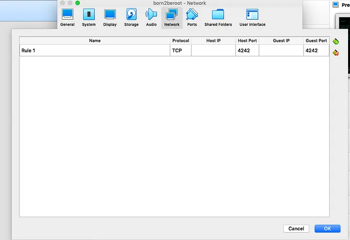

# Born2beRoot

**Este projeto visa criar uma máquina virtual em\
VirtualBox sob instruções específicas.**

*Ao final deste projeto, você poderá configurar seu próprio\
sistema operacional enquanto implementa regras estritas.*
 
 

 Skills | Grade |
:------:|:-----:|
[Network & system administration] [Rigor] | **:white_check_mark: 125%**

<!-- ### *Access to the [interactive map](https://faleite.github.io/born2beroot).* -->
<!--  -->

# Índice
### [Especificações do projeto](https://github.com/faleite/42born2beroot/blob/main/dcs/000_subject.md)

## Artigos
1. [Virtual Machine](https://github.com/faleite/42born2beroot/blob/main/dcs/100_vm.md)
2. [Debia vs. Rocky](https://github.com/faleite/42born2beroot/blob/main/dcs/101_debian_rocky.md)
3. [AppArmor](https://github.com/faleite/42born2beroot/blob/main/dcs/102_apparmor.md)
4. [LVM](https://github.com/faleite/42born2beroot/blob/main/dcs/103_LVM.md)
5. [SSH](https://github.com/faleite/42born2beroot/blob/main/dcs/104_SSH.md)
6. [Firewall (ufw)](https://github.com/faleite/42born2beroot/blob/main/dcs/105_firewall.md)
7. [sudo](https://github.com/faleite/42born2beroot/blob/main/dcs/106_sudo.md)
8. [TTY](https://github.com/faleite/42born2beroot/blob/main/dcs/107_TTY.md)
9. [Partições](https://github.com/faleite/42born2beroot/blob/main/dcs/108_particoes.md)
10. [Write all (wall)](https://github.com/faleite/42born2beroot/blob/main/dcs/110_wall.md)
11. [TCP](https://github.com/faleite/42born2beroot/blob/main/dcs/111_TCP.md)
12. [Avaliação](https://github.com/faleite/42born2beroot/blob/main/dcs/113_avaliacao.md)

## Construção
1. [Instalação da VM](https://github.com/faleite/42born2beroot/blob/main/dcs/200_vm_install.md)
2. [Configuração do Sistema](https://github.com/faleite/42born2beroot/blob/main/dcs/201_config.md)
3. [Script de monitoramento](https://github.com/faleite/42born2beroot/blob/main/dcs/202_script.md)
3. [Bônus](https://github.com/faleite/42born2beroot/blob/main/dcs/203_bonus.md)
