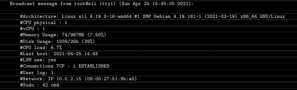
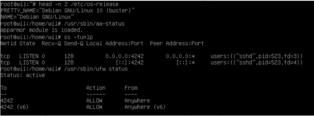

# Subject

## Links
- [Tutorial 1](https://github.com/gemartin99/Born2beroot-Tutorial/blob/main/README_POR.md)
- [Debian ISO](https://www.debian.org/download)

# Guidelines
- O uso do VirtualBox (ou UTM se você não puder usar o VirtualBox) é obrigatório.
- Você só precisa entregar um arquivo signature.txt na raiz do seu repositório.
  - Você deve colar nele a assinatura do disco virtual da sua máquina.\
  Vá em Submissão e avaliação por pares para mais informações.

# Mandatory part

*Este projeto consiste em você configurar seu primeiro servidor seguindo regras\
específicas.*
- Você deve escolher como sistema operacional a última versão estável do Debian\
(sem testing/unstable) ou a última versão estável do Rocky. Debian é altamente\
recomendado se você for novo na administração do sistema.
- Para o Debian o **AppArmor** deve estar em execução na inicialização e sua configuração deve ser adaptada às necessidades do projeto.
- Você deve criar pelo menos *2 partições* criptografadas usando **LVM**. Abaixo\
está um exemplo do particionamento esperado:


- Um  serviço  SSH  será  executado  apenas  na  porta  4242.  Por  razões  de\
segurança,  não  deve  ser possível  conectar  usando  SSH  como  root.
  - *O uso de SSH será testado durante a defesa com a criação de uma nova conta.\
Portanto, você deve entender como funciona.*
- Você tem que configurar seu sistema operacional com o UFW (ou firewalld para\
Rocky) firewall e assim deixar apenas a porta 4242 aberta.
  - *Seu firewall deve estar ativo quando você iniciar sua máquina virtual.*
- O nome do host de sua máquina virtual deve ser seu login terminando em 42\
(por exemplo, wil42). Você terá que modificar este nome de host durante sua\
avaliação.
- Você precisa implementar uma política de senha forte.
- Você deve instalar e configurar o sudo seguindo regras estritas.
- Além do usuário root, um usuário com seu login como nome de usuário deve estar\
presente.
  - Este usuário deve pertencer aos grupos user42 e sudo.
  - *Durante a defesa, você terá que criar um novo usuário e atribuí-lo a um grupo.*
## Política de senha forte
*Para configurar uma política de senha forte, você deve cumprir os seguintes
requisitos:*
- Sua senha deve expirar a cada 30 dias.
- O número mínimo de dias permitido antes da modificação de uma senha será\
definido como 2.
- O usuário deve receber uma mensagem de aviso 7 dias antes de sua senha expirar.
- Sua senha deve ter pelo menos 10 caracteres. Deve conter uma letra maiúscula,\
uma letra minúscula e um número. Além disso, não deve conter mais de 3 caracteres\
idênticos consecutivos.
- A senha não deve incluir o nome do usuário.
- A seguinte regra não se aplica à senha root: A senha deve ter pelo menos 7\
caracteres que não façam parte da senha anterior.
  - Obviamente, sua senha de root deve estar em conformidade com esta política

*Depois de definir seus arquivos de configuração, você terá que alterar todas as\
senhas das contas presentes na máquina virtual, incluindo a conta root.*

### Grupo sudo 
*Para definir uma configuração forte para o seu grupo sudo, você deve cumprir\
os seguintes requisitos:*
- A autenticação usando sudo deve ser limitada a 3 tentativas no caso de um erro\
de senha incorreta.
- Uma mensagem personalizada de sua escolha deve ser exibida se occorer um erro\
devido a uma senha incorreta, ao usar o sudo.
- Cada ação usando o sudo deve ser arquivada, tanto as entradas quanto as saídas.\
o arquivo de registro deve ser salvo na pasta /var/log/sudo/.
- O modo TTY deve ser ativado por motivos de segurança.
- Também por motivos de segurança, os caminhos que podem ser usados pelo sudo\
devem ser restritos.

*Exemplo:*
```sh
/usr/local/sbin:/usr/local/bin:/usr/sbin:/usr/bin:/sbin:/bin:/snap/bin
```

# Script de monitoramento

*Por fim, você deve criar um script simples chamado **monitoring.sh**.\
Deve ser desenvolvido em bash.*

*Na inicialização do servidor, o script exibirá algumas informações (listadas\
abaixo) em todos os terminais a cada 10 minutos (dê uma olhada na **wall**).\
O banner é opcional. Nenhum erro deve ser visível*

*Seu script deve ser sempre capaz de exibir as seguintes informações:*

- A arquitetura do seu sistema operacional e sua versão do kernel.
- O número de processadores físicos.
- O número de processadores virtuais.
- A RAM atualmente disponível em seu servidor e sua taxa de utilização em\
porcentagem.
- A memória disponível no momento em seu servidor e sua taxa de utilização em\
porcentgem.
- A taxa de utilização atual de seus processadores como uma porcentagem.
- A data e hora da última reinicialização.
- Se o LVM está ativo ou não.
- O número de conexões ativas.
- O número de usuários que usam o servidor.
- O endereço IPv4 do seu servidor e seu endereço MAC (Media  Access  Control)
- O número de comandos executados com o programa sudo

*Durante a defesa, você será solicitado a explicar como esse script funciona.\
Você também terá que interrompê-lo sem modificá-lo.
Dê uma olhada no **cron**.*

*Este é um exemplo de como o script deve funcionar:*



*Abaixo estão dois comandos que você pode usar para verificar alguns dos\
requisitos do assunto:*

*Para Debian:*



# Lista de Bonus

*Configure as partições corretamente para obter uma estrutura semelhante à\
abaixo:*


- Configure um site WordPress funcional com os seguintes serviços:\
lighttpd, MariaDB, and PHP.
- Configure um serviço de sua escolha sudo service --status-allque considere útil (NGINX / Apache2\
excluido!). Durante a defesa, você terá que justificar sua escolha.

*Para completar a parte bônus, você tem a possibilidade de configurar serviços\
extras. Nesse caso, você pode abrir mais portas para atender às suas necessidades.\
Obviamente, as regras do UFW/Firewalld devem ser adaptadas de acordo.*

*A parte bônus só será avaliada se a parte obrigatória for PERFEITA. Perfeito\
significa que a peça obrigatória foi executada integralmente e funciona sem\
avarias. Se você não passou em TODOS os requisitos obrigatórios, sua parte de\
bônus não será avaliada.*