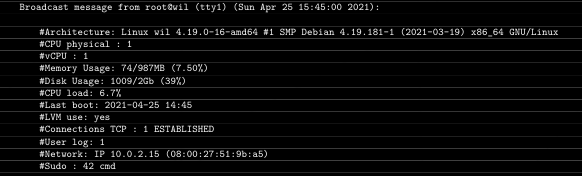

# Script de monitoramento

*Por fim, você deve criar um script simples chamado **monitoring.sh**.\
Deve ser desenvolvido em bash.*

*Na inicialização do servidor, o script exibirá algumas informações (listadas\
abaixo) em todos os terminais a cada 10 minutos (dê uma olhada na **wall**).\
O banner é opcional. Nenhum erro deve ser visível*

*Seu script deve ser sempre capaz de exibir as seguintes informações:*

- A arquitetura do seu sistema operacional e sua versão do kernel.
- O número de processadores físicos.
- O número de processadores virtuais.
- A RAM atualmente disponível em seu servidor e sua taxa de utilização em\
porcentagem.
- A memória disponível no momento em seu servidor e sua taxa de utilização em\
porcentgem.
- A taxa de utilização atual de seus processadores como uma porcentagem.
- A data e hora da última reinicialização.
- Se o LVM está ativo ou não.
- O número de conexões ativas.
- O número de usuários que usam o servidor.
- O endereço IPv4 do seu servidor e seu endereço MAC (Media  Access  Control)
- O número de comandos executados com o programa sudo

*Durante a defesa, você será solicitado a explicar como esse script funciona.\
Você também terá que interrompê-lo sem modificá-lo.
Dê uma olhada no **cron**.*

*Este é um exemplo de como o script deve funcionar:*

*Abaixo estão dois comandos que você pode usar para verificar alguns dos\
requisitos do assunto:*

*Para Debian:*

