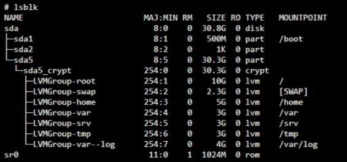

# Lista de Bonus

*Configure as partições corretamente para obter uma estrutura semelhante à\
abaixo:*

- Configure um site WordPress funcional com os seguintes serviços:\
lighttpd, MariaDB, and PHP.
- Configure um serviço de sua escolha sudo service --status-allque considere útil (NGINX / Apache2\
excluido!). Durante a defesa, você terá que justificar sua escolha.

*Para completar a parte bônus, você tem a possibilidade de configurar serviços\
extras. Nesse caso, você pode abrir mais portas para atender às suas necessidades.\
Obviamente, as regras do UFW/Firewalld devem ser adaptadas de acordo.*

*A parte bônus só será avaliada se a parte obrigatória for PERFEITA. Perfeito\
significa que a peça obrigatória foi executada integralmente e funciona sem\
avarias. Se você não passou em TODOS os requisitos obrigatórios, sua parte de\
bônus não será avaliada.*

## Extra
### Instalacao do Docker
- [Tutorial para Debian](https://docs.docker.com/engine/install/debian/)
- Sugestao de imagem Docker para instalar [Alpine](https://hub.docker.com/_/alpine/) . 
  - Uma imagem mínima do Docker baseada no Alpine Linux com um índice de pacote completo e apenas 5 MB de tamanho.
### Uso basico
- Verificar status do **Docker**: `sudo systemctl status docker`
- Rodar imagem no Docker: `docker run hello-world`
- Obter informacoes do Docker: `docker info`
- Verificar images instaladas no Docker: `docker images`
- Ver lista dos contêineres em execução no seu sistema, com informações detalhadas de cada um deles: `sudo docker container ls -l`

### Verificar status de todos os servicos
`sudo service --status-all`