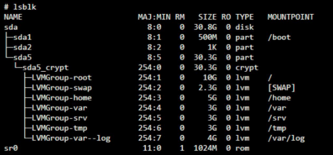

# Lista de Bonus

*Configure as partições corretamente para obter uma estrutura semelhante à\
abaixo:*

- Configure um site WordPress funcional com os seguintes serviços:\
lighttpd, MariaDB, and PHP.
- Configure um serviço de sua escolha que considere útil (NGINX / Apache2\
excluido!). Durante a defesa, você terá que justificar sua escolha.

*Para completar a parte bônus, você tem a possibilidade de configurar serviços\
extras. Nesse caso, você pode abrir mais portas para atender às suas necessidades.\
Obviamente, as regras do UFW/Firewalld devem ser adaptadas de acordo.*

*A parte bônus só será avaliada se a parte obrigatória for PERFEITA. Perfeito\
significa que a peça obrigatória foi executada integralmente e funciona sem\
avarias. Se você não passou em TODOS os requisitos obrigatórios, sua parte de\
bônus não será avaliada.*