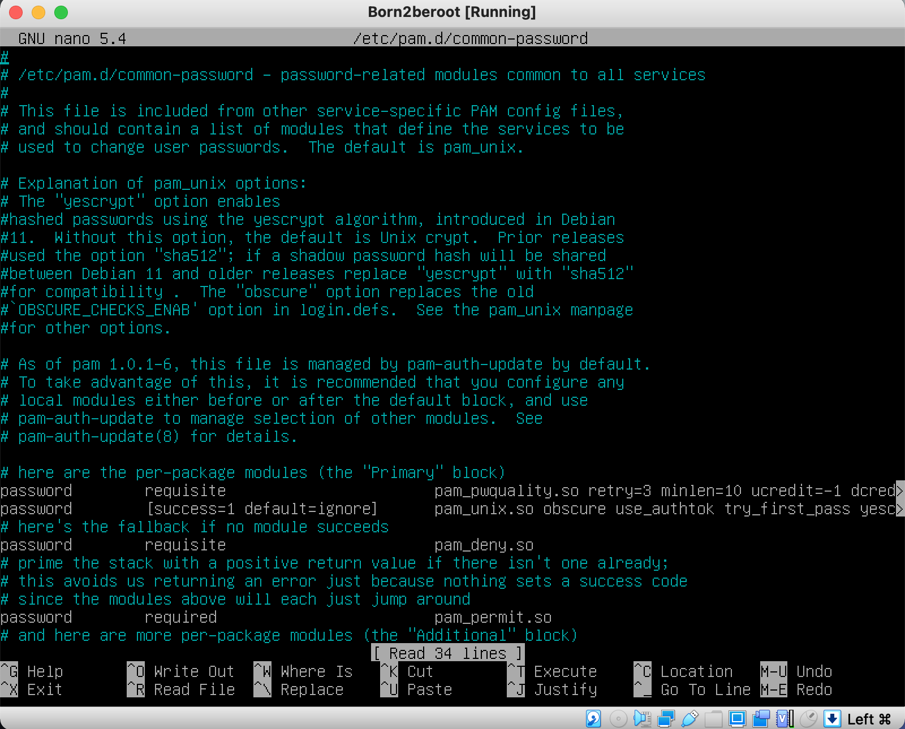
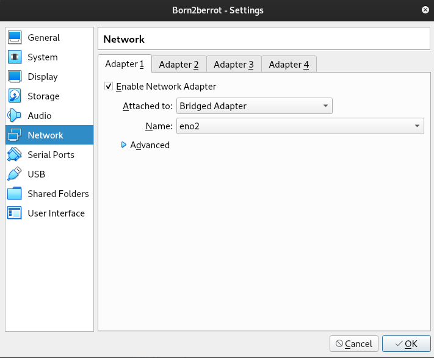

# Configurations

## 1. Users
- Host name (deve ser 42 user + 42): `faaraujo42`
- Domain name (vazio):
- Root password (System administrative account): `faaraujo42lisboa*`
- Full name: `faaraujo`
- User name: `faaraujo`
- Password for the new user: `hello42lisboa`
- Encryption passphrase: `hello42lisboa`

## 2. Sudo utilizadores e grupos
- Entrar no root (utilizador raiz): `su`
- Root password (System administrative account): `faaraujo42lisboa*`
- Antes e bom atualizar os pacotes: `apt update -y` e `apt upgrade -y`
  - *adicionar a opção "-y" ao comando, você está instruindo o sistema\
  a responder automaticamente "sim" a todas as perguntas de confirmação\
  que possam surgir.* 
- Instalar o sudo: `apt install sudo`
- Reiniciar a máquina: `sudo reboot`
- Verificar se sudo instalado (apos entrar no root): `sudo -V`
- Criar utilizador (Ja foi criado no inicio): `sudo adduser faaraujo`
- Criar um novo grupo: `sudo addgroup user42`
  - Sera mostrada a menssagem de sucesso com o **G**roup **Id**entifier Ex.: `(GID 1001)` 
  - Podemos verificar se foi criado o grupo com o cmd: `getent group user42`
  - Podemos ver todos os grupos e utilizadores dentro deles: `cat /etc/group`
- Incluir o utilizador nos grupos: 
  - Grupo user: `sudo adduser faaraujo user42`
  - Grupo sudo: `sudo adduser faaraujo sudo`
  - Verificar se tudo foi feito corretamente: `getent group user42` e `getent group sudo` 

## 3. Install [Apparmor](./102_apparmor)
### 1 Install
1. Verifique se o pacote `apparmor` está instalado em seu sistema:
`sudo apt install apparmor apparmor-profiles apparmor-utils`
2. Reinicie o sistema, garantir que as configurações sejam aplicadas corretamente:
`sudo reboot`
3. Verifique se o AppArmor está em execução:
`sudo systemctl status apparmor`
*Certifique-se de que o status seja "active" ou "running", o que indica que o AppArmor está em execução.*
4. Você pode verificar o status dos perfis do AppArmor com o seguinte comando:
`sudo apparmor_status` ou `/sbin/aa-status`

*O `systemctl` permite gerenciar serviços, unidades e outras funcionalidades relacionadas ao sistema. Consulte a documentação `man systemctl` no terminal.*
- Vejas o status dos serviços no terminal: `systemctl status`

## 4. Install and Config [SSH](./104_ssh)
### 1. Install
- Atualizar os repositorios (/ect/apt/sources.list):
`sudo apt update`
- Instalar OpenSSH (principal ferramenta de conectividade remota):
`sudo apt install openssh-server`
- Verificar se foi instalado correctamente:
`sudo service ssh status` ou `systemctl status ssh.service`
- Ver endereco IP da maquina virtual:
`hostname -I`  (`10.0.2.15`)
### 2. Config 
*Entrar no utilizador root `su`, ou colocar `sudo` no inicio do cmd*

**Primeiro ficheiro a editar: `/etc/ssh/sshd_config`**
-  Editar ficheiro: `nano /etc/ssh/sshd_config`
  1. `Port 22` para `Port 4242`
  2. `PermitRootLogin prohibit-password`  para `PermitRootLogin no`

**Editar ficheiro: `/etc/ssh/ssh_config`**
- Editar ficheiro: `nano /etc/ssh/ssh_config`
  1. `Port 22` para `Port 4242`

**Finalizar Config**
- Reiniciar servico SSH: `sudo service ssh restart`
- Verificar status do SSH: `sudo service ssh status`

## 5. Install and Config [UFW](./105_firewall)
- Instalar UFW: `sudo apt install ufw`
- Activar UFW: `sudo ufw enable`
- Permitir ligações através da porta 4242: `sudo ufw allow 4242`
- Verificar estado da *Firewall*: `sudo ufw status`

## 6. Config senha forte para o [sudo](./106_sudo)
**Criar um ficheiro para armazenar a configuração da senha forte:**
- Caminho a ser armazenado: `/etc/sudoers.d/`
- Criar ficheiro: `touch /etc/sudoers.d/sudo_config`
**Criar diretorio */sudo* para armazenar cada cmd sudo (tanto entrada quanto saida):**
- cirar diretorio: `mkdir /var/log/sudo`
**Editar ficheiro *sudo_config:*** `nano /etc/sudoers.d/sudo_config`
- Adicionar ao ficheiro:
```bash
Defaults    passwd_tries=3
Defaults    badpass_message="Mensaje de error personalizado"
Defaults    logfile="/var/log/sudo/sudo_config"
Defaults    log_input, log_output
Defaults    iolog_dir="/var/log/sudo"
Defaults    requiretty
Defaults    secure_path="/usr/local/sbin:/usr/local/bin:/usr/sbin:/usr/bin:/sbin:/bin:/snap/bin"
```
**Sobre o que cada comando no ficheiro faz:**
```bash
# Numero de tentativas em caso de introduzir contrasenha errada.
Defaults  passwd_tries=3
# Menssagem que sera mostrada ao introduzir senha errada.
Defaults  badpass_message="Mensaje de error personalizado"
# Arquivo onde sera registrado todos os comandos sudo.
Defaults  logfile="/var/log/sudo/sudo_config"
# Para que cada cmd executado com o sudo seja arquivado no dir. especificado.
Defaults  log_input, log_output
Defaults  iolog_dir="/var/log/sudo"
# Para ativar o modo TTY.
Defaults  requiretty
# Para restringir os diretorios que serao utilizados com o sudo.
Defaults  secure_path="/usr/local/sbin:/usr/local/bin:/usr/sbin:/usr/bin:/sbin:/bin:/snap/bin"
```

## 7. Config politica senha forte
**Editar ficheiro *login.defs*:**
- Editar ficheiro: `nano /etc/login.defs`
- Modificar os seguintes parâmetros:
  1. `PASS_MAX_DAYS 99999`  para `PASS_MAX_DAYS 30` (Tempo de expiracao da palavra-passe).
  2. `PASS_MIN_DAYS 0` para `PASS_MIN_DAYS 2` (Minimo de dias permitido antes de alterar uma palavra-passe).
  3. `PASS_WARN_AGE 7` (Menssagem  de numero de dias ate a palavra passe expirar)

**Instalar pacotes de instalacao *[libpam-pwquality](./106_sudo)*:**
- Instalar pacotes: `sudo apt install libpam-pwquality`
**Editar ficheiro common-password da lib pam.d**
- Editar ficheiro: `nano /etc/pam.d/common-password`
  1. Adicionar apos a linha com o titulo `# here are the per-package modules (the "Primary" block)` .
  2.  Ao fina desta linha adicione: `minlen=10 ucredit=-1 dcredit=-1 lcredit=-1 maxrepeat=3 reject_username difok=7 enforce_for_root`

**Como deve ser a aparecia do ficheiro:**


### O que cada comando faz:
1. `minlen=10`  *O número mínimo de caracteres que a senha deve conter.*
2. `ucredit=-1`  *Deve conter pelo menos uma letra maiúscula. Colocamos o - como deve conter pelo menos um caracter, se colocarmos + queremos dizer no máximo esses caracteres.*
3. `dcredit=-1`  *Deve conter pelo menos um dígito.*
4. `lcredit=-1` *Deve conter pelo menos uma letra minúscula.*
5. `maxrepeat=3` *Não se pode ter o mesmo carácter mais de 3 vezes seguidas.*
6. `reject_username` *Não pode conter o nome do utilizador.*
7. `difok=7`  *Deve ter pelo menos 7 caracteres que não façam parte da senha antiga.*
8. `enforce_for_root`  *Iremos implementar esta política para o utilizador de raiz.*

## 8. Conectar via SSH

**Feche a maquina virtual**

*Adicionar regra de encaminhamento para o VirtualBox*

1. Vá para VirtualBox-> Escolha a VM->Selecione Configurações
2. Escolha “Rede”-> “Adaptador 1"->”Avançado”->”Encaminhamento de porta”

3. Insira os valores conforme mostrado:

4. Abra a VM e reinicie o servidor SSH:
`sudo systemctl restart ssh`
5. Verifique o status do ssh:
`sudo service sshd status`
6. Do lado do host do iTerm2 ou Terminal, digite como mostrado abaixo:
`ssh username@127.0.0.1 -p 4242` ou `ssh username@localhost -p 4242`
7. Encerre a conexão:
`exit` ou `logout`

### Links
- [SSH](https://www.youtube.com/watch?v=GO57OOnBhQ0)
- [Tutorial](https://baigal.medium.com/born2beroot-e6e26dfb50ac)

