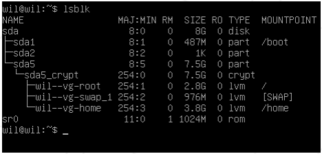

# Subject

## Links
- [Tutorial](https://github.com/gemartin99/Born2beroot-Tutorial/blob/main/README_POR.md)

## Guidelines
- O uso do VirtualBox (ou UTM se você não puder usar o VirtualBox) é obrigatório.
- Você só precisa entregar um arquivo signature.txt na raiz do seu repositório.
  - Você deve colar nele a assinatura do disco virtual da sua máquina.\
  Vá em Submissão e avaliação por pares para mais informações.

## Mandatory part

*Este projeto consiste em você configurar seu primeiro servidor seguindo regras\
específicas.*
- Você deve escolher como sistema operacional a última versão estável do Debian\
(sem testing/unstable) ou a última versão estável do Rocky. Debian é altamente\
recomendado se você for novo na administração do sistema.
- O **SELinux** deve estar em execução na inicialização e seu a configuração\
deve ser adaptada às necessidades do projeto. **AppArmor**  para o Debian também\
deve estar rodando na inicialização.
- Você deve criar pelo menos *2 partições* criptografadas usando **LVM**. Abaixo\
está um exemplo do particionamento esperado:
- Um  serviço  SSH  será  executado  apenas  na  porta  4242.  Por  razões  de\
segurança,  não  deve  ser possível  conectar  usando  SSH  como  root.
  - *O uso de SSH será testado durante a defesa com a criação de uma novo conta.\
Portanto, você deve entender como funciona.*
- Você tem que configurar seu sistema operacional com o UFW (ou firewalld para\
Rocky) firewall e assim deixar apenas a porta 4242 aberta.
  - *Seu firewall deve estar ativo quando você iniciar sua máquina virtual.*

## Perguntas
- Sobre o sistema operacional escolhido. (Debian ou Rocky)
  - Porque e qual as sua diferenças.
- Qual as diferenças  entre  **aptitude**  e **apt**
- O  que  é  **SELinux**  ou  **AppArmor**
- *Obs. Entenda sobre tudo o que for usado no projeto*

